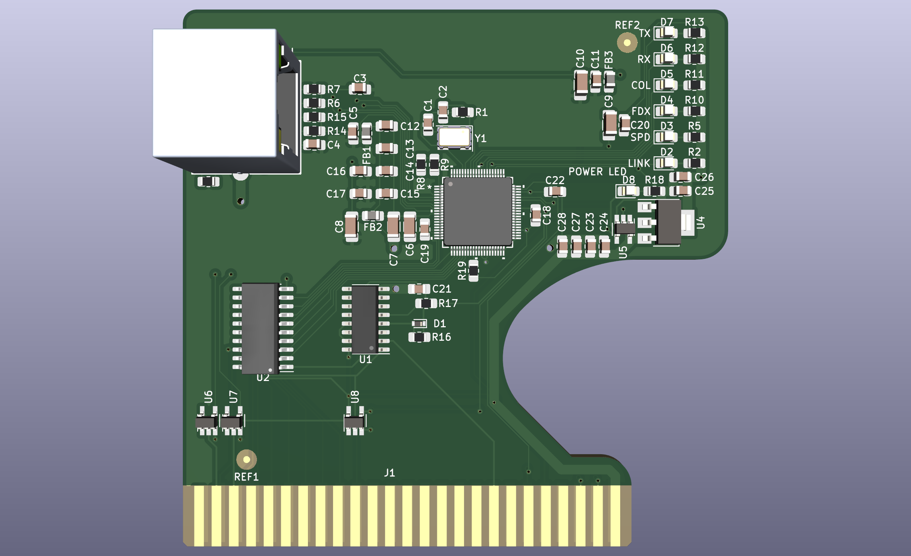

# Uthernet II

* The a2RetroSystems [Uthernet II](http://a2retrosystems.com/products.htm) product page
* The Uthernet II [User’s and Programmer’s Manual](http://dserver.macgui.com/Uthernet%20II%20manual%20draft.pdf)
* An Uthernet II [Applications Overview](http://www.a2retrosystems.com/downloads.htm)
* Some Uthernet II [Programming Infos](https://github.com/a2retrosystems/uthernet2/wiki)

## Description
Recreation of the Uthernet II Apple II Network Expansion Card using KiCAD 6.x. 
This version is a recreation of the Uthernet II board with the 80-pin W5100 chip.  
This version is NOT compatible with the light pipe system of the original. 
The board size is limited to 100mm x 100mm to make it cheaper to produce. 
This layout may be able to be improved. 

### PCB Layout

### See Also
[Apple_II_Expansion Card_Specification](https://github.com/ayourk/Apple2Proto/raw/master/Apple_II_ExpansionCard_Spec.txt)
